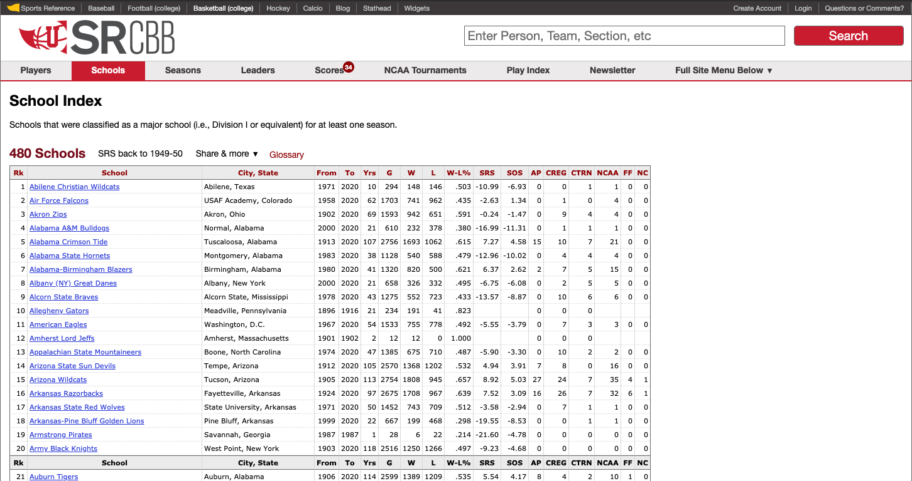
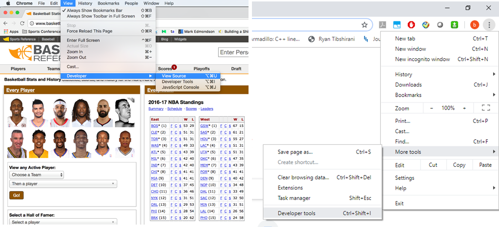
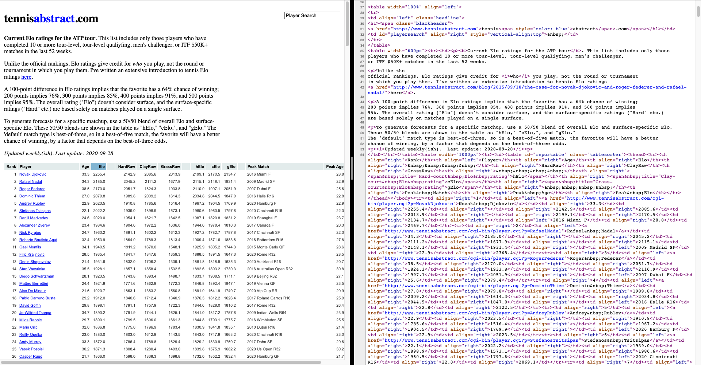
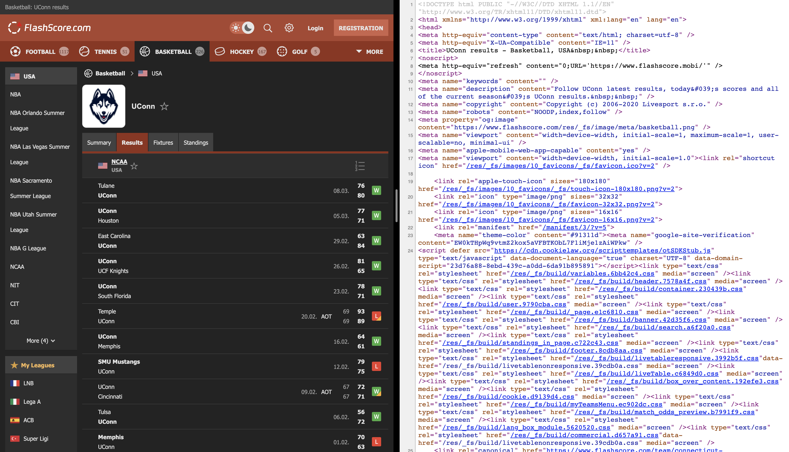
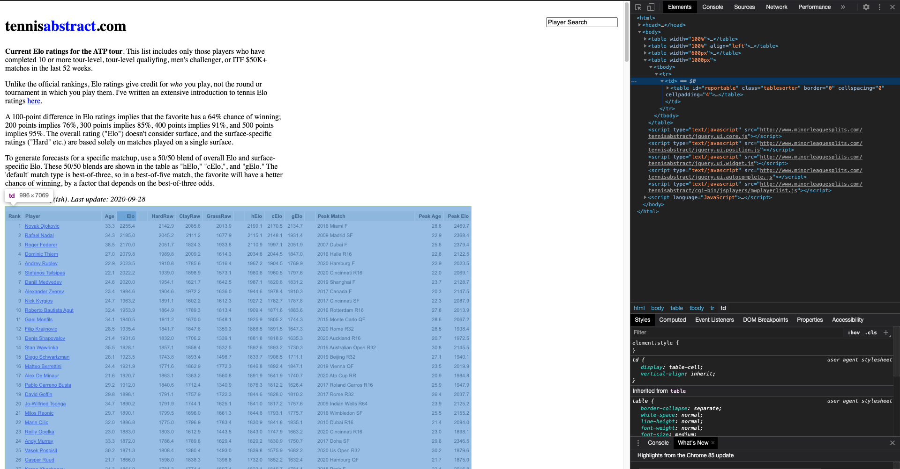
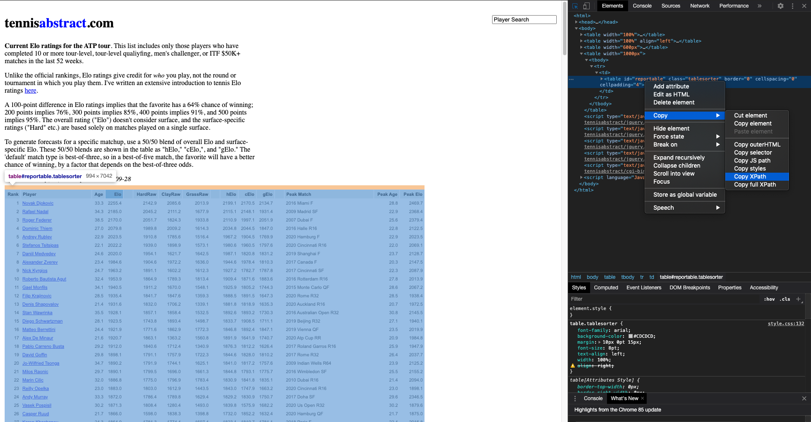
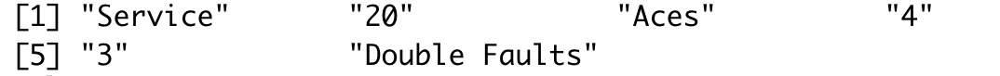
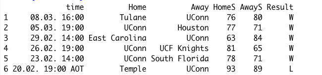

```{r setup, include=FALSE}
knitr::opts_chunk$set(echo = FALSE)
require("rvest")
require("RSelenium")
```


## Outline

* Introduction

<!--   + Prerequisite -->
<!--   + Motivation of Web Scraping -->

* Web Scraping Techniques Using R

  + Import files downloaded from websites
  + Static data
  + Dynamic data

* Summary


## Introduction

* Web scraping technique is used for capturing data from websites.

* Motivation of Web Scraping

  + Need to extract data from websites
  + A reproducible way of capturing data online

* Prerequisite

  + Having experience with R
  + A laptop with R and R studio installed

## Example

[College basketball school index](https://www.sports-reference.com/cbb/schools/)

* These data can be obtained by copying and pasting manully.

* Web scraping technique helps capture the data efficiently.



## Web Scraping Using R

* Different web scraping techniques are required when we are facing different kinds of data.

* Data have been organized into files.

  - Directly download it and read it in R

* Data are contained in HTML pages.

  - Static data
  - Dynamic data

## Import Data Files from Websites

* These files that can be read by **read.csv** or related functions.

* They can be directly imported from a URL.

- Example: we extract the most recent Australian Open Tennis Championships match [(AUS Open)](http://www.tennis-data.co.uk/ausopen.php):
```{r echo=TRUE, message=FALSE, warning=FALSE, results='hide'}
url <- "http://www.tennis-data.co.uk/2020/ausopen.csv"
tennis_aus <- read.csv(url)
str(tennis_aus)
```


## Static Data and Dynamic Data

* Most of data in the web are not organized into files, which can be directly imported into R.

* Before we capture these data, we need to determine whether the data are static or dynamic based on the source code.

* Static data is the data that can be seen in the source code.

* We cannot see the dynamic data in the source code.

## Static Data and Dynamic Data

* The source code can be accessed by View $\rightarrow$ Developer $\rightarrow$ View Source in Chrome. Or right click the website and choose "View Page Source".



## Static Data and Dynamic Data

Exerciese: Determine what kind of the data are in the following examples, static or dynamic.

* http://tennisabstract.com/reports/atp_elo_ratings.html

* https://www.flashscore.com/team/connecticut-huskies/8rqVf3Tj/results/


## Static Data and Dynamic Data



This is static data.

## Static Data and Dynamic Data



This is dynamic data.


## Web Scraping for Static Data in R

R provides several approaches for web scraping the static data. Two of them will be discussed in this workshop.

* **readLines** function: Read the source code of the HTML pages.

* **rvest** package: Capture useful data by identifying the elements contains the data in the source code. 

## Web Scraping for Static Data in R

Use **readLines** function for [College basketball school index](https://www.sports-reference.com/cbb/schools/). 

\tiny
```{r echo=TRUE, message=FALSE, warning=FALSE}
web_page <- readLines("https://www.sports-reference.com/cbb/schools/")
head(web_page, n = 10L)
```

\normalsize

* Gives the source code.

* Needs data cleaning and organization.


## Web Scraping for Static Data in R

Before we talk about web scraping by **rvest** package, we need to know how to locate the elements containing the data in the source code.

* Right click the page and choose "Inspect".

* Click "Select an element in the page to inspect it".

* We can locate the elements by CSS selector or XPATH.

## Web Scraping for Static Data in R

Use http://tennisabstract.com/reports/atp_elo_ratings.html as an example

* CSS selector: id = "reportable", class = "tablesorter"




## Web Scraping for Static Data in R

* XPATH: '//*[@id="reportable"]'



## Web Scraping for Static Data in R

Next, we are going to talk about how to use **rvest** for web scraping by using an example.


* Install **rvest** package from cran.

\footnotesize
```{r pckgs, eval=FALSE, echo=TRUE}
install.packages("rvest", repos = "http://cran.us.r-project.org")
require("rvest")
```


## Web Scraping for Static Data in R

* Web scraping data from http://tennisabstract.com/reports/atp_elo_ratings.html

\footnotesize
```{r echo=TRUE, message=FALSE, warning=FALSE}
url_elo <- "http://tennisabstract.com/reports/atp_elo_ratings.html"
webpage <- read_html(url_elo)
elo_class <- webpage %>% 
  html_nodes(".tablesorter") %>% 
  html_table()
elo_id <- webpage %>% 
  html_nodes("#reportable") %>% 
  html_table()
identical(elo_class, elo_id)
```

## Web Scraping for Static Data in R

\tiny
```{r echo=TRUE, message=FALSE, warning=FALSE}
elo_xpath <- webpage %>% 
  html_nodes(xpath = '//*[@id="reportable"]') %>% 
  html_table()
identical(elo_class, elo_xpath)
head(elo_class[[1]])
```

\normalsize

## Web Scraping for Static Data in R

* Except **html_nodes** and **html_table**, there are many other frequently used functions in **rvest**.

  - **html_node** : extract element
  - **html_text** : extract text
  - **html_attrs** : extract attributes
  - **html_form** : extract forms

* Please look up [rvest cran](https://cran.r-project.org/web/packages/rvest/rvest.pdf) for more information.

* [SelectorGadget](https://cran.r-project.org/web/packages/rvest/vignettes/selectorgadget.html) is a convenient tool to identify CSS selector.


## Web Scraping for Dynamic Data in R

* What dynamic data display in the website can be changed in response to the user interaction. 

* We need to automate the web browsing process in R for the dynamic data.

* **RSelenium** package helps this automating process by providing connection to Selenium Server.

* Install **RSelenium** package.

\footnotesize
```{r eval=FALSE, message=FALSE, warning=FALSE, echo = TRUE}
devtools::install_github("ropensci/RSelenium")
require("RSelenium")
```

\normalsize

## Web Scraping for Dynamic Data in R

* Use **RSelenium** to extract data on [2017 Australian Open Final](http://www.flashscore.com/match/Cj6I5iL9/#match-statistics;0)


## Web Scraping for Dynamic Data in R

* Connect to a selenium server and open brower.

\footnotesize
```{r eval=FALSE, message=FALSE, warning=FALSE, echo = TRUE}
rD <- rsDriver(port = 5561L, chromever = "85.0.4183.87")
remDr <- rD$client
```

\normalsize

* Extract Information and organize data.

\footnotesize
```{r eval=FALSE, message=FALSE, warning=FALSE, echo = TRUE}
url <- "http://www.flashscore.com/match/Cj6I5iL9/#match-statistics;0"
remDr$navigate(url)
webElem <- remDr$findElements(using = 'class', "statBox")
webElem <- unlist(lapply(webElem, function(x){x$getElementText()}))[[1]]
# head(unlist(strsplit(webElem, split = '\n')))
remDr$close()
```

\normalsize


## Web Scraping for Dynamic Data in R

* Frequently used functions of **RSelenium**:

  - rsDriver() : start a selenium server
  - navigate() : navigate web pages
  - findElements() : find elements by CSS seclector or XPATH
  - getPageSource() : get current page source
  - clickElement() : click element
  
* Please go to [RSelenium cran](https://cran.r-project.org/web/packages/RSelenium/RSelenium.pdf) for more details.

## Web Scraping for Dynamic Data in R

Exercise: Web Scraping for the history basketball recording of UConn

https://www.flashscore.com/team/connecticut-huskies/8rqVf3Tj/results/

* Start a selenium server and open web brower.

\footnotesize
```{r eval=FALSE, message=FALSE, warning=FALSE, echo = TRUE}
require("RSelenium")
rD <- rsDriver(port = 5533L, chromever = "85.0.4183.87")
remDr <- rD$client
url <- "https://www.flashscore.com/team/connecticut-huskies/8rqVf3Tj/results/#"
remDr$navigate(url)
```
\normalsize

## Web Scraping for Dynamic Data in R

* Automate to click all "show more results".

\footnotesize
```{r eval=FALSE, message=FALSE, warning=FALSE, echo = TRUE}
repeat{
  b <- tryCatch({
    suppressMessages({
      webElemMore <- remDr$findElement(using = 'xpath', 
                        '//*[@id="live-table"]/div[1]/div/div/a')
      webElemMore$clickElement()
    })
  }, error = function(e) e)
  if(inherits(b, "error")) break
}
```
\normalsize

* Extract data, such as time, home/away, score and result.

\footnotesize
```{r eval=FALSE, message=FALSE, warning=FALSE, echo = TRUE}
webElemTime <- remDr$findElements(using = 'xpath', 
                              '//*[@class="event__time"]')
webElemTime <- 
  unlist(lapply(webElemTime, function(x){x$getElementText()}))
webElemTime <- gsub("\\n", " ", webElemTime)
```
\normalsize

## Web Scraping for Dynamic Data in R

\footnotesize
```{r eval=FALSE, message=FALSE, warning=FALSE, echo = TRUE}
webElemHome <- 
  remDr$findElements(using = 'class', 
                     'event__participant')
webElemHome <- 
  unlist(lapply(webElemHome, function(x){x$getElementText()}))

webElemScore <- 
  remDr$findElements(using = 'class', 'event__score')
webElemScore <- 
  unlist(lapply(webElemScore, function(x){x$getElementText()}))

webElemResult <- 
  remDr$findElements(using = 'class', 'wld')
webElemResult <- 
  unlist(lapply(webElemResult, function(x){x$getElementText()}))
```
\normalsize

## Web Scraping for Dynamic Data in R

* Organize dataset.

\footnotesize
```{r eval=FALSE, message=FALSE, warning=FALSE, echo = TRUE}
n <- length(webElemHome)
basketball <- 
  data.frame(time = webElemTime,
             Home = webElemHome[seq(n) %% 2 == 1],
             Away = webElemHome[seq(n) %% 2 == 0],
             HomeS = webElemScore[seq(n) %% 2 == 1],
             AwayS = webElemScore[seq(n) %% 2 == 0],
             Result = webElemResult)

head(basketball)
remDr$close()
```
\normalsize



## Summary

* For different kinds of data, we need to use different web scraping techiniques with R.

* One can simply use **read.csv** or related functions to directly import organized files from web pages.

* The static data can be extract with the help of **rvest**.

* We could use **RSelenium** to parse the dynamic data.


## Resources

- [CSS and HTML crash course](http://flukeout.github.io/)

- [rvest](https://cran.r-project.org/web/packages/rvest/rvest.pdf)

- [RSelenium](https://cran.r-project.org/web/packages/RSelenium/vignettes/basics.html)

- [R task view: web technology](https://cran.r-project.org/web/views/WebTechnologies.html)


## Acknowledgement

This slides are modified from [Dr. Kovalchik's material](https://github.com/skoval/UseRSportTutorial) and [Wanwan Xu's slides](https://github.com/wanwanx/WebScraping_UCSAS).


